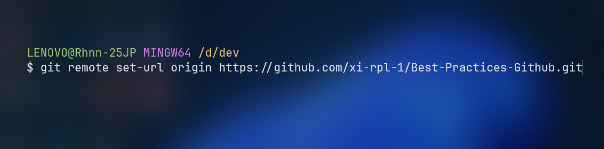
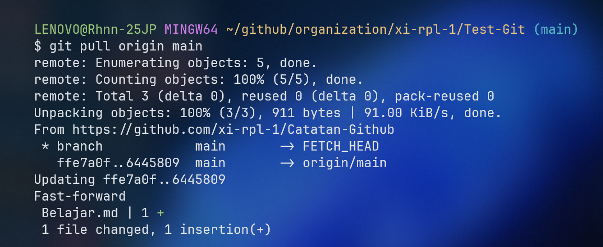

# Menghubungkan Repository Lokal dengan Remote

1. **Inisialisasi Repository Lokal**:
   ```bash
   git init
   ```
   
2. **Tambahkan Remote**:
   ```bash
   git remote add origin https://github.com/username/repository.git
   ```
   

# Remote

## Menambahkan Remote Baru

1. **Tambahkan Remote Baru**:
   ```bash
   git remote add <remote_name> <remote_url>
   ```
   contoh:
   
2. **Verifikasi Remote**:
   ```bash
   git remote -v
   ```
   

## Mengubah URL Remote

1. **Mengubah URL**:
   ```bash
   git remote set-url <remote_name> <new_remote_url>
   ```
   contoh:
   

# Push

## Mengirim Perubahan ke Remote

1. **Cek Perubahan**:
   ```bash
   git status
   ```
   
2. **Staging Perubahan**:
   ```bash
   git add .
   ```
   
3. **Commit Perubahan**:

   ```bash
   git commit -m "Deskripsi perubahan"
   ```

   

4. **Push ke Remote**:
   ```bash
   git push origin main
   ```
   

# Pull

## Mengambil Perubahan dari Remote

1. **Pull dari Remote**:
   ```bash
   git pull origin main
   ```
   
